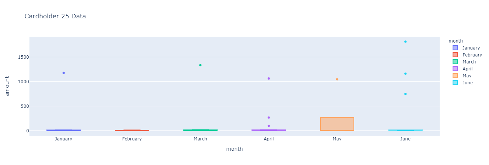

# Fraud Detection
---
### We are attempting to analyze transaction data to see which credit card smay be comprimised. In order to do so we run various queries on a SQL database and pull some data into python/pandas to help us visualize the possibel fraud.

#### Setup:

In order to begin analyzing data, I must create a SQL database so I have an orginized form of data. Please see below for my database ERD:

#### Step 1A: Analyzing the transactions:

It is known to us that fraudster often use charges less than 2.00 to commit fraud. Hence, I first ran a query to see how which credit cards had the most charges less than 2.00. The results showed that most credit cards had only a couple of charges less than 2.00, but there were a few cards that stood out to me. The cartds I list below had mroe than 10 charges less than 2.00:

376027549341849,
4743204091443101526,
344119623920892,
180098539019105,
584226564303,
3516952396080247,

Right off the bat these look suspicious just by an eyeball test of the data. Later I will go into more formal calculations and hypothesis tests to test if these counts were statistically significant enough to claim they are fraudulent. For now I want to run a similar "eyeball" test to see if there is a lot of suspicious transactions between the hours of 7AM and 9AM. In order to do so, I pulled a query of all the transactions between those times, grouped by card number once again. I was looking to see if there is a big overlap between teh cards that have a lot of transactions between this time and the cards that have a lot of transactions under 2.00. These were the cards that had mroe than 10 transactions between these times:

4498002758300,
4723783028106084756,
584226564303,

Right off the bat I see one overlapping card number "584226564303", but I am still not convinced that there is correlation between this time frame and farud transactions, so I take my investigation one step further. Now I want to compare the **proportion(%) of potentially fraud(<2.00) transactions in that timeframe** with the **proportion of potentially fraud transactions total**. I find that between 7AM and 9AM there are 30 out of 275 potentially fraud transactions, which is about *10.9%*. In all the transactions there are exactly 350 out of 3500 potentially fraud transactions, which is *10%*. In my opinion, that 0.9% difference can be due to routine sampling error, instead of a statistcially significant difference in proportions, but later in this project I will oficially test this with a Hypothesis Test. To summarize, I found that 7AM to 9AM does not seem to have a higher amount of fraud transactions than average, making that timeframe a weak indication of fraud. 

#### Step 1B: Analyzing Merchants:

Now that I have established that small transactions are the best way to detect fraud, I want to see which merchants have the most small transactions. Afetr running the query, I found that there was 3 specific merchants that had more than 5 ptentially fraud transactions:

Baker Inc
Hood-Phillips
Wood-Ramirez

#### Step 2A: Cardholder 2 and 18 Analysis

In part 2, we are worried that two of our loyal customers have comprimised credit cards, so we use Python/PyViz/SQL to investigate. I used python to get a DataFrame with cardholder 2 and cardholder 18's trransaction data, and then graphed it to see if any irregularities are present:

As we can see very easil, cardholder 2's line plot is esentially very constant, ranging from 1-17. This sounds like a very normal spending pattern and does not raise much concern. Looking at cardholder 18, we see a very different story. Cardholder 18's spending is mainly concentrated in that same 1-17 range as cardholder 2, but there are 6/7 very clear outliers, which raise concern. It seems like cardholder 18's card(s) may bve comprimised and a fraudster is using it to make a few very large purchases. This trend is very obvious to see in the graph, and in my opinion will not requirte a formal hypothesis test to prove that 18's card has been comprimised.

#### Step 2B: 

Now we want to run a similar analysis on cardholder 25, because she suspects that her card may be comprimised. In this case I only want to analyze the first 6 months of the year, so I pull the Data and plot a box plot. Here are the results:

As you can see, it looks like there are many fraud transactions. The only month that seems clear of fraud is February. January, March, and May have 1 outlier each. April and June have 3 outliers each. In this situation, it is clear that fraud has occured since there are an overwhelming number of credit card charges that are very far from the mean, and a hypothesis test is not required.

#### Challenge (Hypothesis Tests):

Now I want to go back and test whether or on any of the credit cards have "unsually" large amounts of charges under 2.00. In order to define what unsually large, I mean large enough that the count typically shouldn't occur. I determine that at a 5% significance level, any value above 11.028314199666596 is considered "odd", which leaves two credit cards:

376027549341849,
584226564303

